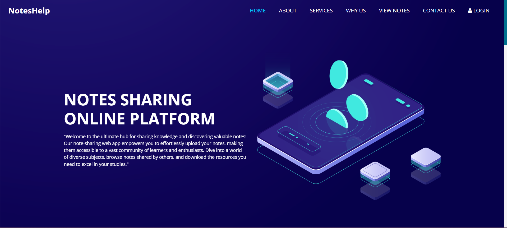
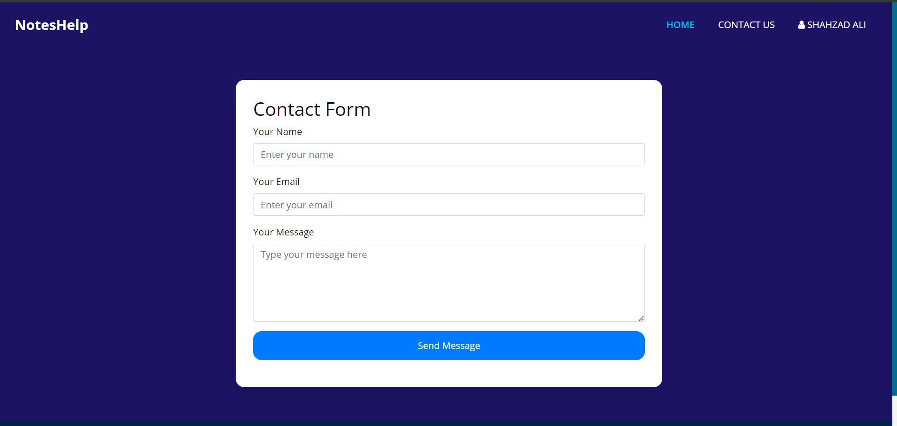

# NotesHelp

NotesHelp is a Laravel-based application designed to assist users in managing and sharing notes efficiently. This project provides a user-friendly interface to upload, delete, and organize notes securely.


## Features
- User authentication (Login/Sign-Up).
- Upload, view, and delete notes.
- Profile management.
- Contact form to reach support.
- Responsive and user-friendly design.


## Technologies Used

- **Backend Framework**: Laravel
- **Frontend**: Blade Templates, Bootstrap
- **Database**: MySQL
- **Package Manager**: Composer, NPM
- **Additional Tools**: Web3Forms for contact form functionality


## Installation Instructions

### Prerequisites

1. Ensure the following are installed on your system:
   - PHP (>= 8.0)
   - Composer
   - Node.js and NPM
   - MySQL
2. A web server like Apache or Nginx.

### Steps

1. **Clone the Repository**:
   ```bash
   git clone https://github.com/Shahzad-Ali-44/NotesHelp.git
   cd NotesHelp
   ```

2. **Install Dependencies**:
   - Install PHP dependencies via Composer:
     ```bash
     composer install
     ```

3. **Set Up Environment**:
   - Copy the example environment file and configure it:
     ```bash
     cp .env.example .env
     ```
   - Update `.env` with your database credentials and other configurations:
     ```env
     DB_CONNECTION=mysql
     DB_HOST=127.0.0.1
     DB_PORT=3306
     DB_DATABASE=your_database_name
     DB_USERNAME=your_username
     DB_PASSWORD=your_password
     ```

4. **Generate Application Key**:
   ```bash
   php artisan key:generate
   ```

5. **Run Storage Link Command**:
   ```bash
   php artisan storage:link
   ```
   This command creates a symbolic link between the `storage` directory and the `public` directory, ensuring file uploads work correctly.


6. **Run Migrations**:
   ```bash
   php artisan migrate
   ```

7. **Serve the Application**:
   ```bash
   php artisan serve
   ```
   The application will be accessible at `http://localhost:8000`.

8. **Upload Notes**:
   - To display content on the homepage and user profile page, ensure that you upload notes via the "Upload Notes" section after logging in.


## Contact Form Configuration

To enable the contact form functionality, follow these steps:

1. **Get an Access Key**:
   - Visit [Web3Forms](https://web3forms.com/) and sign up to get your free access key.

2. **Update the `.env` File**:
   - Add the following entry to your `.env` file:
     ```env
     WEB3FORMS_ACCESS_KEY=your-access-key-here
     ```

3. **How It Works**:
   - The contact form uses the Web3Forms API to send messages to the email address you configure in your Web3Forms account.
   - Ensure your application has internet access to communicate with the Web3Forms API.


## Usage

1. **Authentication**:
   - Register or log in to access features.
2. **Notes Management**:
   - Upload notes via the "Upload Notes" section.
   - View or delete notes from your profile.
3. **Contact Support**:
   - Use the contact form to send messages to the support team.


## Screenshots

### Home Page

*This is the home page of the project.*

### Upload Notes Page

*This is the upload notes page of the project.*

### Profile Page

*This is the profile management section where users can view and edit their information.*

### Contact Form

*This is the contact form where users can send messages to the support team.*


## Directory Structure

```
NotesHelp/
├── app/                # Application core files
├── bootstrap/          # Bootstrap files
├── config/             # Configuration files
├── database/           # Migrations and seeds
├── public/             # Public assets (CSS, JS, images)
├── resources/          # Blade templates and raw assets
├── routes/             # Application routes
├── storage/            # Logs, cache, and uploaded files
├── tests/              # Unit and feature tests
├── .env.example        # Example environment configuration
├── composer.json       # PHP dependencies
├── package.json        # Node.js dependencies
└── artisan             # Artisan CLI
```


## Contribution Guidelines

1. Fork the repository.
2. Create a new branch for your feature/bug fix:
   ```bash
   git checkout -b feature-name
   ```
3. Commit your changes and push to your branch:
   ```bash
   git push origin feature-name
   ```
4. Open a pull request and describe your changes.


## License
This project is licensed under the [MIT License](LICENSE).

## Acknowledgements
- Laravel framework
- Bootstrap for responsive design
- Web3Forms for contact form submissions
